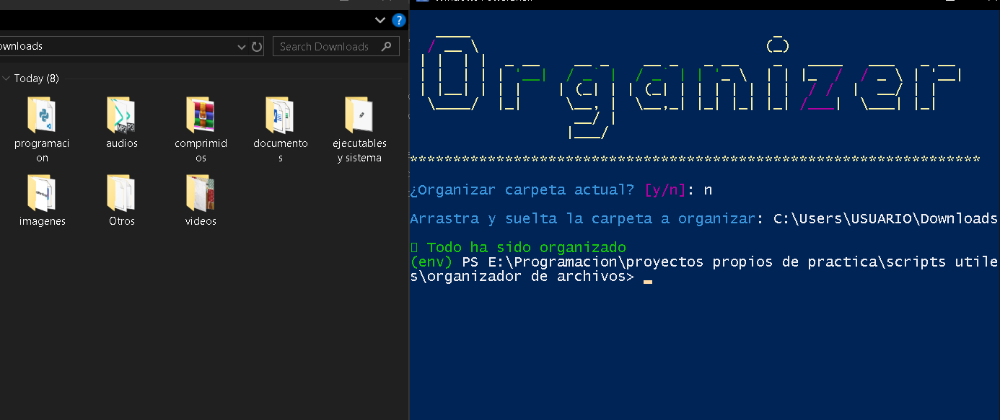

# Organizador de archivos con python
Este script organiza automáticamente los archivos de una carpeta en subcarpetas según su tipo y extensión.

---
## Caracteristicas
- Clasifica imágenes, videos, audios, documentos, ejecutables, archivos comprimidos, fuentes y archivos de programación.
- Detecta y gestiona archivos duplicados.
- Interfaz de terminal hecha con la libreria [Rich](https://github.com/Textualize/rich).
- Permite elegir la carpeta actual o arrastrar otra carpeta para organizar.

---
## 📦 Instalación
- Descarga el script.
- Instala las dependencias necesarias con:

```bash
pip install rich
```
---
## uso
1. Ejecuta el script desde terminal o usa el ejecutable(solo para windows).
2. Se preguntará si se desea organizar la carpeta actual
    - Si reponde **Y**, se organizara la carpeta donde se ejecuto.
    - Si responde **N**, pedira que arraste la carpeta y la suelte
3. Esperar al que el proceso termine

## 📁 Estructura de carpetas

Al ejecutar el script, se crearán subcarpetas automáticamente según el tipo de archivo. Estas son las categorías por defecto:

- `imagenes`: `.jpg`, `.jpeg`, `.png`, `.gif`, `.bmp`, `.svg`, `.tiff`, `.jfif`
- `videos`: `.mp4`, `.avi`, `.mov`, `.mkv`, `.webm`, `.flv`
- `audios`: `.mp3`, `.wav`, `.aac`, `.flac`, `.ogg`, `.wma`
- `documentos`: `.pdf`, `.doc`, `.docx`, `.txt`, `.xls`, `.xlsx`, `.xlsb`, `.ods`, `.csv`, `.ppt`, `.pptx`, `.odt`, `.epub`
- `ejecutables y sistema`: `.exe`, `.msi`, `.app`, `.bat`, `.sh`, `.dll`
- `comprimidos`: `.zip`, `.rar`, `.7z`, `.tar.gz`, `.iso`
- `programacion`: `.html`, `.css`, `.js`, `.py`, `.json`, `.xml`, `.sql`
- `fuentes`: `.ttf`, `.otf`, `.woff`, `.woff2`
- `otros`: cualquier archivo que no coincida con las categorías anteriores
- `DUPLICADOS`: subcarpetas dentro de cada categoría donde se colocan archivos repetidos

## Ejemplo


---
## Notas
- Los archivos duplicados se mueven a una subcarpeta llamada `DUPLICADOS` dentro de la categoría correspondiente.
- Si ejecutas el script dentro de una carpeta que contiene el propio script, este **no se moverá**.
- Puedes modificar las extensiones soportadas editando el diccionario `tipos_de_archivo` en el script.